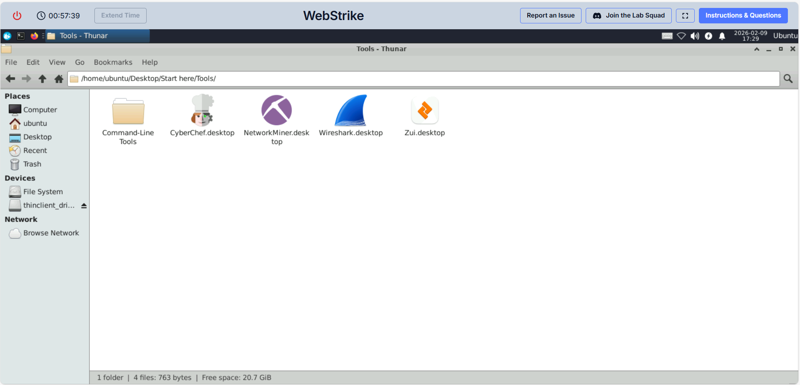
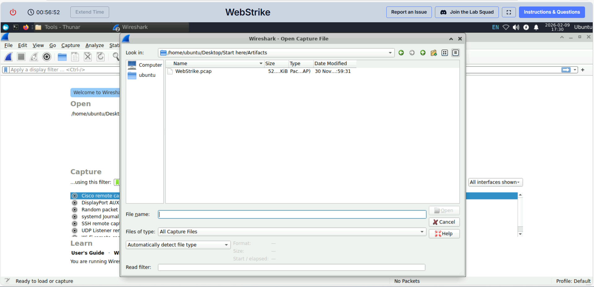
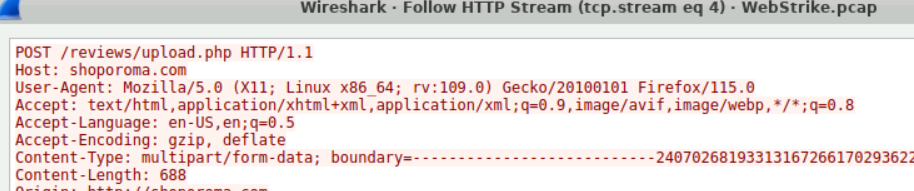

# WebStrike Lab – Network Forensics

## 1. Descripción del laboratorio
Este laboratorio consiste en el análisis de un archivo PCAP para investigar el posible compromiso de un servidor web.  
El objetivo es identificar cómo ocurrió la intrusión y qué tipo de actividad maliciosa se llevó a cabo.

## 2. Objetivos
- Analizar tráfico de red sospechoso.
- Identificar posible subida de web shell.
- Detectar comunicación de tipo reverse shell / C2.
- Identificar indicios de exfiltración de datos.
- Practicar análisis forense de red con Wireshark.

## 3. Herramientas utilizadas
- Wireshark

## 4. Metodología de análisis
1. Revisión general del tráfico de red en el PCAP.
2. Filtrado de tráfico relevante (HTTP, conexiones sospechosas, transferencias de datos).
3. Identificación de peticiones y respuestas anómalas.
4. Análisis de posibles cargas maliciosas y comunicaciones externas.
5. Correlación de eventos para reconstruir la línea temporal del ataque.

## 5. Análisis paso a paso

### 5.1 Inicio del laboratorio y evidencias

El laboratorio utilizado es **WebStrike** (CyberDefenders):
https://cyberdefenders.org/blueteam-ctf-challenges/webstrike/

Al iniciar la máquina, se abre un entorno Linux con una carpeta **Start here** en el escritorio. Dentro se incluyen los artefactos del reto y accesos directos a herramientas.

Capturas:
- Entorno inicial de la máquina:
  

- Carpeta "Start here":
  

### 5.2 Acceso a herramientas e importación del PCAP

Dentro de `Start here` se encuentra la carpeta `Tools`, donde está disponible **Wireshark**.

Pasos:
1. Abrir `Start here`.
2. Entrar en `Tools`.
3. Ejecutar Wireshark.
4. Importar el PCAP proporcionado (por ejemplo: `WebStrike.pcap`) desde la carpeta `Artifacts`.

Capturas:
- Carpeta Tools:
  

- Importación del PCAP en Wireshark:
  

### 5.3 Vista inicial del tráfico y columnas relevantes

Una vez cargado el PCAP, se visualizan los paquetes capturados. En una primera revisión se observa tráfico principalmente **TCP** y **HTTP**, lo que encaja con un escenario de servidor web.

Para facilitar el análisis, añadí las columnas de **Source Port** y **Destination Port**, ya que los puertos ayudan a identificar:
- Servicio atacado (por ejemplo HTTP/80)
- Puerto origen del cliente
- Posibles conexiones adicionales (reverse shell, exfiltración, etc.)

Cómo añadir columnas en Wireshark:
1. Click sobre cualquier paquete.
2. En el panel de detalles, localizar `Transmission Control Protocol`.
3. Click derecho sobre `Source Port` y `Destination Port`.
4. Seleccionar **Apply as Column** (en algunas versiones aparece como “Apply as Column”).
   - Alternativa: `Ctrl + Shift + I` según configuración/version.

Captura:
- Paquetes y columnas con puertos:
  

### 5.4 Identificación del flujo inicial (cliente → servidor web)

Con las columnas de puertos ya visibles, se identifica rápidamente un flujo que destaca:

- IP origen: `117.11.88.124`
- Puerto origen: `43848`
- IP destino: `24.49.63.79`
- Puerto destino: `80`
- Protocolo: `TCP` y posteriormente `HTTP`

Esto indica que `117.11.88.124` actúa como cliente y establece conexión contra un servicio web HTTP en `24.49.63.79:80`.

Además, se observa el patrón típico de una sesión web:
- Handshake TCP (SYN/SYN-ACK/ACK)
- Peticiones HTTP (GET/POST)
- ACKs intercalados propios del flujo TCP

Captura:
- Flujo TCP/HTTP inicial:
  

---

## 6. Preguntas del laboratorio (con evidencias)

### 6.1 Pregunta 1: Origen geográfico de la IP atacante

La pregunta solicita la ciudad de origen del ataque. Dado que el laboratorio no tiene acceso a Internet, la IP se consulta desde un servicio externo.

IP identificada como atacante por el flujo inicial:
- `117.11.88.124` (cliente que inicia conexión al servidor web)

Se realizó la consulta con:
- VirusTotal (información ASN/ISP)
- IP2Location (geolocalización más detallada)

Resultados relevantes:
- ASN: `4837`
- Organización: `China Unicom China169 Backbone`
- País: `China (CN)`
- Ciudad reportada: `Tianjin`

Respuesta:
- **Tianjin**

(En el repositorio se pueden adjuntar capturas de pantalla de las consultas externas si se desea.)

---

### 6.2 Pregunta 2: User-Agent completo del atacante

Para identificar el User-Agent, se selecciona un paquete HTTP (por ejemplo un `GET / HTTP/1.1`) y se inspecciona el contenido del flujo.

Pasos en Wireshark:
1. Seleccionar un paquete HTTP del flujo `117.11.88.124 → 24.49.63.79`.
2. Click derecho → **Follow** → **HTTP Stream**.
3. Revisar las cabeceras de la petición.

En el stream se observa el campo `User-Agent`:

`Mozilla/5.0 (X11; Linux x86_64; rv:109.0) Gecko/20100101 Firefox/115.0`

Respuesta:
- **Mozilla/5.0 (X11; Linux x86_64; rv:109.0) Gecko/20100101 Firefox/115.0**

Captura recomendada:
- HTTP Stream mostrando el User-Agent:
  

---

### 6.3 Pregunta 3: Nombre del web shell subido con éxito

Para detectar explotación/vulnerabilidad, se revisan peticiones HTTP tipo **POST**, especialmente hacia endpoints de subida.

Filtro útil para localizar subidas:

## 7. Conclusión
Este laboratorio permitió practicar el análisis de tráfico de red en un escenario de compromiso realista, reforzando habilidades en:
- Network Forensics
- Identificación de actividad maliciosa en PCAPs
- Uso de Wireshark para investigación de incidentes
- Reconstrucción de la cadena de ataque desde el tráfico de red

## 8. Qué aprendí / qué mejoré
- Mejora en el uso de filtros y análisis de flujos en Wireshark.
- Mayor facilidad para identificar patrones de tráfico malicioso.
- Mejor comprensión de cómo se ve un ataque real a nivel de red.
